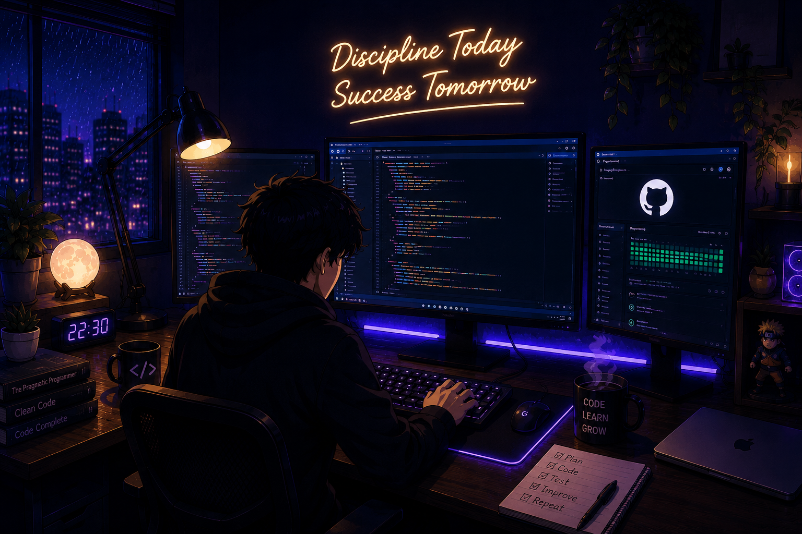

# Deepdas Somani

### Computer Science Engineering (Artificial Intelligence)

---

  

---

## 🎓 Education

- **Bachelor of Technology (B.Tech)**
- **Computer Science Engineering (Artificial Intelligence)**
- **JK Lakshmipat University, Jaipur**
- **CGPA:** **9.07 / 10**

---

## 💻 Tech Stack

  

---

## 🤖 AI / ML

Python • NumPy • Pandas • Scikit-Learn • Matplotlib

---

## 📊 GitHub Stats

---

## 🔥 GitHub Streak

---

## 📈 Contribution Graph

---

## 🌐 Connect With Me

</a>

&nbsp;&nbsp;&nbsp;

